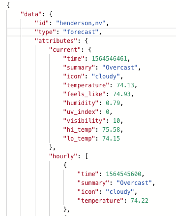

# README
Whether Sweater is a solo project for Module 3 of the The Turing School of Software and Design's Backend Engineering Program. The project is meant to demonstrate proficiency in generating and consuming APIs.  The intent is that this would be the backend of a larger project, where the API calls would passed back and forth to a front end part of the project.  The link for the production project is: `https://afternoon-castle-43645.herokuapp.com/`

## Forecast

### /api/v1/forecast?location=city,st

A user can make an API call to get the weather for a particular city.  The API call then makes a call to Google to get the latitude and longitude for the city.  That data is then passed to the DarkSky site, which returns a JSON response with the weather.  That JSON response is then parsed and formatted into a tailored JSON response to the original API call.  Two separate services are used for the Google and DarkSky sites.  A facade is used to customize the data for the API response, and a serializer is used generate the JSON response.  A portion of the JSON response is shown below (as seen using Postman):

## Background

### GET /api/v1/backgrounds?location=city,st

In addition to generating the forecast, another API call can be made which will grab a photograph relevant to the city that the forecast is being made for.  This would allow a front end team to be able to use the photograph as a background when generating the layout of the forecast page.  Pixabay was used as the photo sharing site from which the API request is made to.  A Pixabay service is used to interface with Pixabay, and a background serializer and facade are used to format the JSON response to the original API call.

## User

### POST /api/v1/users

This project also has the capability for a user to create an account.  The user sends a POST request with their email, password, and password confirmation (in the body of the request).  The user is created and their information is stored in the database.  The API response is an API key specific to that user.  A 201 status code is also returned.  

## Login

### POST /api/v1/sessions

After the account is created, the user can then send a POST request to login to their account.  The user logs in by including their email and password in the body of the post request.  The users API key is returned in the response, as is a status code 200.

## Road Trip

### POST /api/v1/road_trip

The road trip endpoint tells the user what the forecast is for a destination city at the time the user should arrive in that city.  The user posts an origin city, destination city, and their API key in the body of the request.  A call is made to the Google directions API to calculate the time at which the user should arrive.  A second call is made to the DarkSky API to get the weather at that time for that destination city.  An improper or missing API key will result in a 401 status code.

## App Details

* Caching

Caching is used in the app to help speed up performance, and to prevent multiple API calls from having to be made.  The caching limit is set for fifteen minutes.  This allows the weather data to be updated frequently, but not so much as to slow down overall app performance.

* Ruby version

Ruby version 2.6.3, Ruby on Rails versions 5.2.3, Bundler versions 1.17.3, and Postgresql version 11.1 were used to create this app.

* Using the app

To use the app, clone down the repo by running
`git clone git@github.com:earl-stephens/whether_sweater.git`
`bundle install`
`rake db:{create,migrate,seed}`

The use of Postman is recommended for performing tasks such as sending POST and DELETE requests.

* Database

The application uses a Postgresql database.  There is only one table in the database - Users.  This table has three attributes: email, password, api_key.

* How to run the test suite

The app was developed using RSpec.  To run the test suite, from the main app directory in the terminal, type in the command `rspec` to launch the test suite.

* Changes

To suggest changes to the application, you can
1. Fork the repo
2. Create a feature branch where you can make the changes
3. Commit the changes
4. Push the feature branch
5. Create a new pull request
